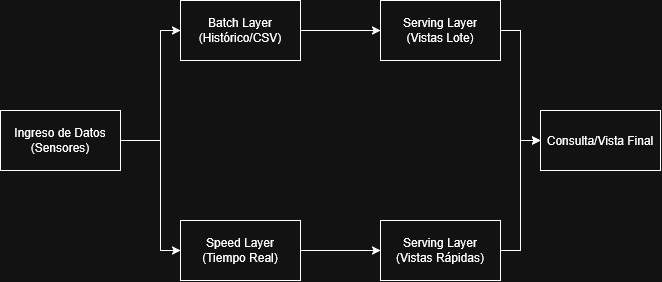
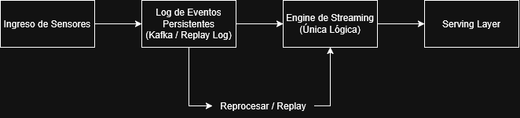

# Aplicación al caso de Big Data 

### Andrés Tadeo Carmona Capula
### IDIA222
### 05/10/2026

---

## 📌 Resumen

Este informe presenta la evaluación técnica y estratégica del sistema de monitoreo de maquinaria industrial a partir del análisis masivo de **100,000 mediciones** capturadas en cuatro plantas operativas. A través del procesamiento en Jupyther/Pandas, se identificaron patrones térmicos críticos y se establecieron los cimientos arquitectónicos para la futura ampliación del sistema a escala de Big Data.

### 📊 Cuadro Mando de Indicadores Clave (KPIs)

| Métrica Analizada | Resultado Obtenido | Relevancia Operativa |
| :--- | :--- | :--- |
| **Volumen Total de Mediciones** | **100,000 registros** | Muestra representativa de 40 sensores en 4 plantas. |
| **Sensores Monitoreados** | **40 sensores activos** (S001 a S040) | Cobertura total de la maquinaria evaluada. |
| **Lecturas en Estado de Alerta ($> 85\ ^\circ\text{C}$)** | **6,954 lecturas** (6.95% del total) | Umbral crítico que requiere inspección técnica. |
| **Planta con Mayor Riesgo Térmico** | **Planta_3** (1,777 alertas) | Focalización del 25.55% de todas las alertas globales. |
| **Temperatura Máxima Registrada** | **$104.99\ ^\circ\text{C}$** (4 eventos empatados) | Picos térmicos extremos en sensores S014, S019, S023 y S030. |

---

## 5. Las 5 V aplicadas al proyecto

A continuación se presenta la caracterización del proyecto mediante el marco de las **5 V del Big Data**, contrastando la fase analítica actual con las necesidades operativas de la futura expansión del sistema.

| V de Big Data | Explicación de cómo se relaciona con el sistema de sensores | Ejemplo Concreto | ¿CSV actual o Futura ampliación? |
| :--- | :--- | :--- | :--- |
| **Volumen** | Representa la cantidad masiva y la escala de almacenamiento requerida para los datos generados por las máquinas. | **100,000 registros** en el archivo `sensores_industriales.csv` ($\sim 4.4\text{ MiB}$). En la ampliación, al recibir lecturas cada segundo desde miles de sensores, el volumen escalará a Gigabytes/Terabytes diarios. | Aparece en el **CSV actual** ($100\text{k}$ registros) y escala en la **Futura ampliación**. |
| **Velocidad** | Frecuencia con la que se registran, transmiten y procesan las lecturas de los sensores. | Frecuencia actual de **1 lectura por minuto** por sensor. En la ampliación, la frecuencia se incrementará a **mediciones por segundo** en tiempo real. | Se observa a baja frecuencia en el **CSV actual**; su máxima velocidad es de la **Futura ampliación**. |
| **Variedad** | Diversidad en los formatos, estructuras y fuentes de información que el sistema debe almacenar e integrar. | En la actualidad solo se maneja un formato tabular estructurado (`.csv`). La ampliación integrará **fotografías de máquinas** y **reportes de mantenimiento** en texto libre. | Variedad simple en el **CSV actual**; variedad multimodal en la **Futura ampliación**. |
| **Veracidad** | Nivel de precisión, calidad, ruido o anomalías térmicas presentes en los datos capturados. | Detección de picos atípicos extremos, como la **temperatura máxima de $104.99\ ^\circ\text{C}$** registrada simultáneamente en 4 sensores distintos. | Evaluado en el **CSV actual** (control de calidad de las lecturas). |
| **Valor** | Utilidad práctica y beneficios de negocio derivados de transformar los datos crudos en decisiones de mantenimiento. | Identificación de **6,954 alertas térmicas** y determinación de la **Planta_3 como punto crítico ($1,777$ alertas)** para generar el archivo `resultados/alertas.csv`. | Generado en el **CSV actual** (y pilar estratégico para la ampliación). |

---

## 6. Tipos de datos y procesamiento tradicional

### Clasificación de Elementos del Sistema

1. **El CSV de sensores:** **Estructurado**. Posee un esquema estricto de filas y columnas, con tipos de datos atómicos definidos (`int`, `str`, `float`, `datetime`).
2. **Un mensaje JSON enviado por un sensor:** **Semiestructurado**. Carece de la rigidez de una tabla relacional, pero utiliza llaves o etiquetas (`keys`) con pares clave-valor que le otorgan organización interna.
3. **Una fotografía de una máquina:** **No estructurado**. Consiste en un mapa de píxeles binarios que no posee un modelo de datos o formato tabular subyacente.
4. **El texto libre de un reporte de mantenimiento:** **No estructurado**. Contiene lenguaje natural redactado libremente por los ingenieros de planta, sin campos normalizados.

### ¿Por qué 100,000 registros no convierten automáticamente al archivo en Big Data?

Un archivo de 100,000 registros ocupa únicamente **$4.4\text{ MiB}$** en disco. Este volumen de información cabe por completo en la memoria RAM de cualquier computadora estándar y puede ser cargado y procesado secuencialmente en milisegundos mediante Pandas o la biblioteca estándar de Python. Para ser considerado **Big Data**, el volumen, velocidad y variedad deben sobrepasar las capacidades físicas de un solo equipo, haciendo obligatorio el uso de sistemas de cómputo distribuido (como Apache Spark o Hadoop).

### Limitaciones técnicas que aparecerían al aumentar la escala

Al escalar a miles de sensores emitiendo mediciones cada segundo:

* **Saturación de Memoria (RAM Exhaustion):** Cargar un archivo que crezca a cientos de Gigabytes usando `pd.read_csv()` generará errores fatales de *Out of Memory (OOM)*.
* **Cuellos de botella en I/O:** El formato CSV es texto plano no comprimido, lo que vuelve ineficientes las lecturas, escrituras y consultas sobre grandes volúmenes.
* **Procesamiento Secuencial Lento:** Un programa secuencial de un solo hilo no podrá procesar miles de eventos entrantes por segundo, acumulando latencia e incumpliendo los tiempos de respuesta.

---

## 7. Batch y Streaming

### 1. Tipo de Procesamiento Realizado y Justificación

* **Procesamiento realizado:** **Batch (Por Lotes)**.
* **Justificación:** El programa analizó un conjunto de datos estático, delimitado e histórico (`sensores_industriales.csv`) guardado en almacenamiento secundario. La totalidad de los 100,000 registros se leyó y procesó en un único bloque de ejecución.

### 2. Enfoque para Emitir Alertas Inmediatas ($> 85\ ^\circ\text{C}$)

* **Enfoque recomendado:** **Streaming (Procesamiento en Tiempo Real)**.
* **Justificación de tiempo:** Cuando la temperatura de un motor sobrepasa los **$85\ ^\circ\text{C}$**, el riesgo de falla catastrófica es inmediato. Se requiere una arquitectura de baja latencia (pocos segundos) basada en eventos (usando herramientas como Apache Kafka o Spark Streaming) para evaluar cada lectura de forma individual en cuanto es emitida.

### 3. Enfoque para Generar el Resumen Diario

* **Enfoque recomendado:** **Batch (Procesamiento Programado / Lote Nocturno)**.
* **Justificación de tiempo:** Un reporte consolidado diario (promedios por planta, conteo total de alertas) no requiere inmediatez. Se puede programar un trabajo Batch para ejecutarse al cierre de operaciones, consolidando de manera eficiente la totalidad de los datos acumulados durante las 24 horas.

---

## 8. Arquitecturas Lambda y Kappa

### Escenario A: Combinación de recálculo histórico en lote con procesamiento en tiempo real

* **Arquitectura Elegida:** **Arquitectura Lambda**.
* **Justificación:** La arquitectura Lambda divide el procesamiento en tres capas:
  1. **Batch Layer:** Mantiene el dataset maestro inmutable y recalcula con alta precisión las vistas históricas acumuladas.
  2. **Speed Layer:** Procesa los datos recientes en tiempo real para ofrecer respuestas de baja latencia.
  3. **Serving Layer:** Fusiona los resultados de ambas rutas para responder a las consultas de los usuarios.

### Escenario B: Unificación del procesamiento de eventos con capacidad de reprocesamiento

* **Arquitectura Elegida:** **Arquitectura Kappa**.
* **Justificación:** La arquitectura Kappa simplifica la infraestructura eliminando la ruta de lotes por separado. Todo el flujo de datos se procesa mediante un **único motor de Streaming**. Si se necesita recalcular o analizar el historial, los eventos se vuelven a reproducir (*replay*) desde un registro inmutable (como Apache Kafka con retención extendida) utilizando el mismo código de procesamiento.

---

## 9. Nivel de Analítica: Descriptiva, Predictiva y Prescriptiva

### 1. Analítica Descriptiva (¿Qué sucedió?)

Basado en los resultados extraídos del cuaderno `analisis.ipynb`:

* **Hallazgo 1:** La **Planta_3** fue la instalación más crítica de todo el sistema, registrando **1,777 lecturas por encima de los $85\ ^\circ\text{C}$** (equivalente al 25.55% de todas las alertas detectadas).
* **Hallazgo 2:** La temperatura máxima absoluta registrada fue de **$104.99\ ^\circ\text{C}$**, correspondiente a 4 eventos empatados en los sensores `S023`, `S019`, `S014` y `S030` entre el 01/09/26 y el 02/09/26.

### 2. Analítica Predictiva (¿Qué podría ocurrir?)

* **Pregunta Predictiva:** *¿Cuál es la probabilidad de que los motores de la Planta_3 sufran una falla mecánica destructiva por sobrecalentamiento sostenido en las próximas 48 horas?*
* **Datos adicionales necesarios para investigarla:**
  1. **Serie de tiempo continua de vibración (`vibracion_mm_s`):** Para evaluar si el incremento térmico viene acompañado de desalineación o desgaste de rodamientos.
  2. **Histórico de bitácoras de fallas:** Para entrenar modelos supervisados con eventos de avería pasados.
  3. **Límites de tolerancia del fabricante:** Especificaciones técnicas de temperatura máxima continua por modelo de máquina.

### 3. Analítica Prescriptiva (¿Qué debemos hacer?)

* **Acción Prescriptiva Recomendada:** Reagendar de inmediato el plan de mantenimiento preventivo, despachando una cuadrilla de inspección técnica a la **Planta_3** y reduciendo temporalmente la carga operativa en los sensores que registraron picos de $104.99\ ^\circ\text{C}$.
* **Información a revisar antes de ejecutar la decisión:**
  1. **Duración de las alertas:** Verificar si los $104.99\ ^\circ\text{C}$ fueron picos momentáneos de carga o sobrecalentamiento continuo.
  2. **Correlación de vibración:** Confirmar si los sensores con picos térmicos mostraron simultáneamente niveles inusuales de vibración.
  3. **Historial de lubricación y refrigeración:** Comprobar si el sistema de enfriamiento de la Planta_3 recibió mantenimiento reciente.

---

## 🚀 Conclusiones y Plan de Acción Recomendado

1. **Corto Plazo (Inmediato):** Utilizar la lista exportada en `resultados/alertas.csv` para auditar los sensores `S014`, `S019`, `S023` y `S030` que alcanzaron la temperatura máxima de $104.99\ ^\circ\text{C}$.
2. **Mediano Plazo:** Migrar la ingesta del CSV local a un sistema de mensajería en tiempo real (**Apache Kafka**) implementando la **Arquitectura Kappa**, anticipando el cambio de frecuencia a lecturas por segundo.
3. **Largo Plazo:** Integrar las fotografías de maquinaria y reportes de texto libre utilizando almacenes de datos no estructurados (Data Lake / S3) para alimentar modelos predictivos multimodales.

---